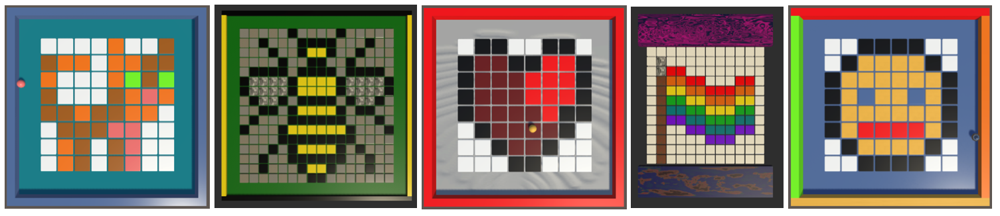
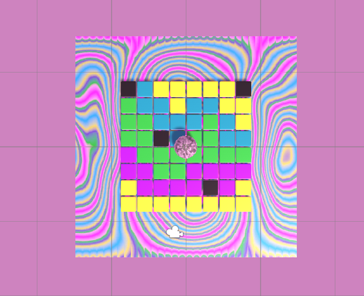
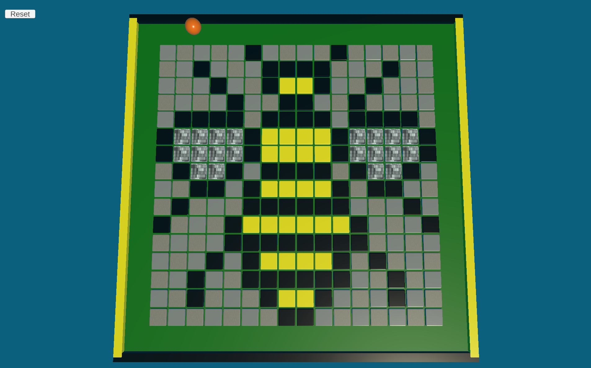
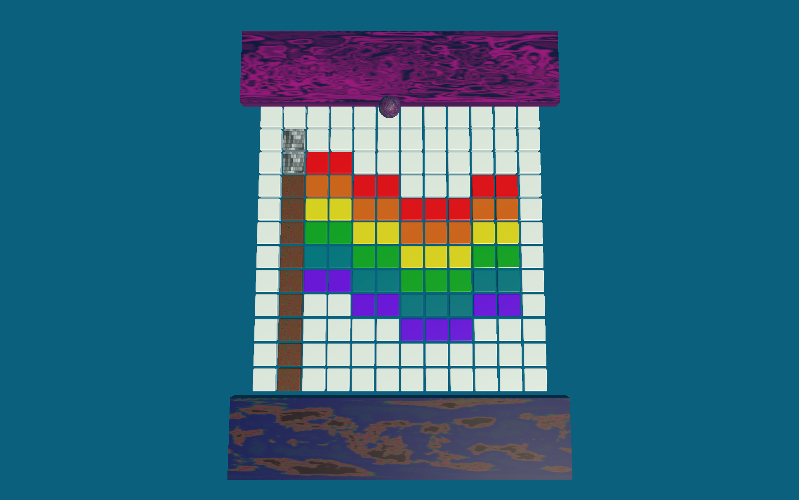
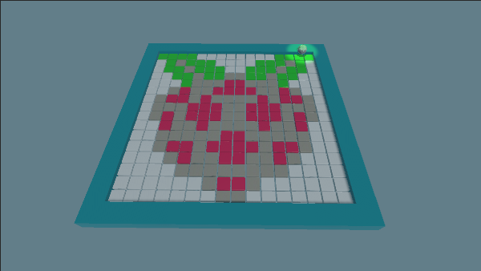

## You will make

In this project you will design some pixel art which the player reveals by rolling a ball over the tiles. 

You will:

+ Choose the size and scenery for your pixel art
+ Design your own pixel art
+ Decide how to reset the scene

### You will need

This project requires the Unity Editor, which can be installed from the Unity Hub. This is a large download and install, so we recommend you install it before starting this project.

You can follow our [Unity guide](https://projects.raspberrypi.org/en/projects/unity-guide){:target="_blank"} to install Unity Hub and the Unity Editor for your operating system.

You will also need to download the [Unity starter package](https://rpf.io/p/en/rainbow-run-go){:target="_blank"} of assets before starting.

--- no-print ---

### Play 🎡

Control the movement of the ball using <kbd>WASD</kbd> (or <kbd>ZQSD</kbd>) or the arrow keys. Roll over tiles to reveal the pixel art design.

<iframe allowtransparency="true" width="710" height="500" scrolling = "no" src="https://raspberrypilearning.github.io/unity-webgl/PixelArtReveal" frameborder="0"></iframe>

--- /no-print ---

--- print-only ---

--- /print-only ---

### Get ideas 💭

You are going to make some design decisions to build your pixel art.

Explore these example projects to get more ideas:

[Try huge bee pixel art](https://raspberrypilearning.github.io/unity-webgl/HugeBeePixelArt){:target='_blank'}.
{:width="400px"}

[Try pride pixel art](https://raspberrypilearning.github.io/unity-webgl/PridePixelArt){:target='_blank'}.
{:width="400px"}

[Try raspberry pixel art](https://raspberrypilearning.github.io/unity-webgl/RaspberryPixelArt){:target='_blank'}.
{:width="400px"}

