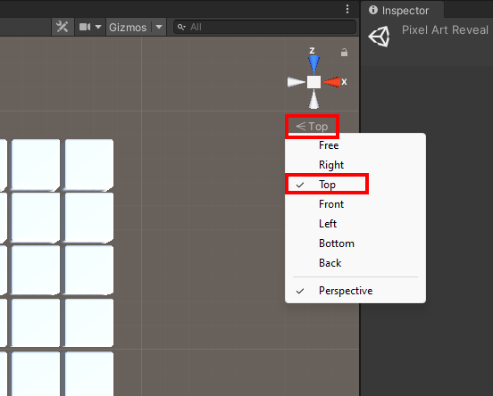
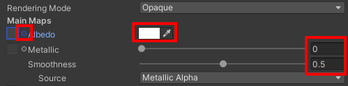
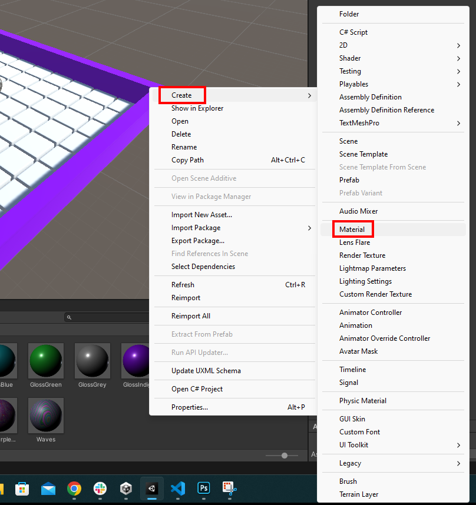

## Set up your scene

In this step you will design your pixel art grid and scenery including walls or safe platforms. 

{:width="350px"}

### Create a project with the starter package

--- task ---

Launch the Unity Hub and click **Projects** then select **New project**:

From the list choose **All templates** then select **3D Core**:

Edit the project settings to give your project a name such as 'Pixel art reveal' and save it to a sensible location. Then click **Create project**.

Your new project will open in the Unity Editor. It may take some time to load.

--- /task ---

--- task ---

The Unity starter package you downloaded for this More Unity path contains a number of **Assets** for you to use in your project.

To import them into your new project, click on the **Assets menu** and select **Import package > Custom Package…** then navigate to the downloaded Unity starter package.

--- collapse ---
---
title: I haven't downloaded a Unity starter package
---

Download and unzip the [More Unity starter package](https://rpf.io/p/en/rainbow-run-go){:target="_blank"} to your computer. 

**Tip:** Choose a sensible location such as your Documents folder. 

--- /collapse ---

[[[unity-importing-a-package]]]

--- /task ---

--- task ---

Right-click on **SampleScene** in the Hierarchy and choose **Save Scene As**: 

In the pop-up window, name your Scene `Pixel Art Reveal`:

A new file will appear in the Assets folder in the Project window.

--- /task ---

### Choose the size of your pixel art

--- task ---

**Choose:** a size for your pixel art. 

The 'Parts' folder in the 'Project' window contains **four** different size floors for you to choose from. You can choose:

+ 6 x 6
+ 8 x 8
+ 12 x 12
+ 16 x 16

A larger floor will allow you to create a more detailed image but it will take longer to create. 

--- /task ---

--- task ---

**Drag** your chosen floor into the scene and reset the transform in the 'Inspector' window. 

--- /task ---

### Create your scenery

--- task ---

**Choose** the best view to build your scene in the scene view. 

--- collapse ---
---
title: Change your view to a top-down view
---

In the top right corner of the 'Scene' view, there is a gizmo labelled X, Y and Z. Underneath this, you will see a menu. Click on the menu and choose 'Top'.

--- /collapse ---

[[[unity-scene-navigation]]]

--- /task ---

--- task ---

**Choose** how your floor will look. You could:

+ Add platforms at the beginning and end
+ Add platforms to each side of your grid
+ Add walls to keep the ball secure and stop it from falling off the edge
+ Add a plane that is larger than the floor

--- collapse ---
---
title: Add start and end platforms to your grid
---

Create a cube GameObject.

Edit the 'Transform Scale' of your cube to match the width of your platform. 

Edit the 'Transform Position' of your cube so that it fits on one end of the platform. 

--- /collapse ---

--- collapse ---
---
title: Add platforms to each side of your grid
---

--- /collapse ---

--- collapse ---
---
title: Add walls and a floor to your grid
---

--- /collapse ---

--- /task ---

--- task ---

**Choose** the materials for your GameObjects. 

--- collapse ---
---
title: Add materials to a GameObject
---

In the 'Projects' window, navigate to the 'Materials' folder.

**Choose** a material and drag it onto the GameObject. 

--- /collapse ---

--- collapse ---
---
title: Create new materials
---

In the 'Projects' window, navigate to the 'Materials' folder.

Right-click and select 'Create -> Material'.

Give the material a sensible name. For example, 'GlossRed' for a material that is red and shiny.

Go to the top of the 'Inspector Window'.

To change the **colour** of your material. Select the colour picker, the default colour is white.

To change the **texture** of your material. Click on the small dot next to 'Albedo' to find a list of available textures.

You can also adjust the 'Metallic' and 'Smoothness' values until you are happy with your new material.

--- /collapse ---

--- collapse ---
---
title: Create a glass material
---

In the 'Project' window. Make sure that you are inside the 'Materials' folder.

Right-click and select 'Create' -> 'Material'. Name the new material 'Glass'.

With the 'Glass' material selected. Go to the 'Inspector' window.

Change the 'Rendering Mode' to 'Transparent'.

Set 'Metallic' to `0.5` and set 'Smoothness' to `0.5`.

Click on the white paint sample next to 'Albedo' and set the 'Alpha' channel to `0`.

--- /collapse ---

--- /task ---

--- task ---

**Choose** the colour of your skybox and create it in your scene.

--- collapse ---
---
title: Create a skybox
---

In the 'Materials' folder in the 'Project' window, add a new material and give it a name.

With the new material selected. Go to the 'Inspector' window.

Change the 'Shader' to 'Skybox -> 6 Sided'.

Change the 'Tint Color' to your chosen colour by moving the R, G, B sliders. 

Drag the new skybox from the 'Materials' folder onto the background of your scene. 

Your scene will change based on the colour that you have chosen. 

--- /collapse ---

--- /task ---

### Set up your camera view

--- task ---

**Choose** where to position your camera. Your viewer will need to see the whole floor in order to see the picture that is revealed. 

--- collapse ---
---
title: Change your view to a top-down view
---

In the top right corner of the 'Scene' view, there is a gizmo labelled X, Y and Z. Underneath this, you will see a menu. Click on the menu and choose 'Top'.

--- /collapse ---

[[[unity-scene-navigation]]]

--- collapse ---
---
title: Align the camera to your current view
---

Right-click on the 'Main Camera' and choose 'Align With View' to the camera view to the scene view.

--- /collapse ---

--- /task ---

--- task ---

**Test** your project by clicking **play**. Make sure that you are happy with:

+ The materials that you have chosen
+ Your skybox colour
+ The position of your camera

--- /task ---

