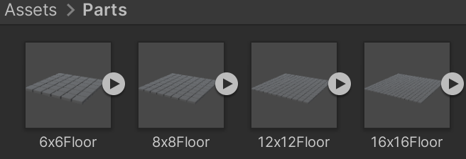
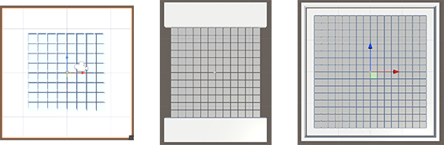

## Set up your scene

In this step you will design your pixel art grid and scenery including walls or safe platforms. 

### Create a project with the starter package

--- task ---

Launch the Unity Hub and click **Projects** then select **New project**:

From the list choose **All templates** then select **3D Core**:

Edit the project settings to give your project a name such as 'Pixel art reveal' and save it to a sensible location. Then click **Create project**.

Your new project will open in the Unity Editor. It may take some time to load.

--- /task ---

--- task ---

The Unity starter package you downloaded for this More Unity path contains a number of **Assets** for you to use in your project.

To import them into your new project, click on the **Assets menu** and select **Import package > Custom Package…** then navigate to the downloaded Unity starter package.

--- collapse ---
---
title: I haven't downloaded a Unity starter package
---

Download and unzip the [More Unity starter package](https://rpf.io/p/en/rainbow-run-go){:target="_blank"} to your computer. 

**Tip:** Choose a sensible location such as your Documents folder. 

--- /collapse ---

[[[unity-importing-a-package]]]

--- /task ---

--- task ---

Right-click on **SampleScene** in the Hierarchy and choose **Save Scene As**: 

In the pop-up window, name your Scene `Pixel Art Reveal`:

A new file will appear in the Assets folder in the Project window.

--- /task ---

### Choose the size of your pixel art

--- task ---

**Choose:** a size for your pixel art. 

The 'Parts' folder in the 'Project' window contains **four** different size floors for you to choose from. You can choose:

+ 6 x 6
+ 8 x 8
+ 12 x 12
+ 16 x 16

A larger floor will allow you to create a more detailed image but it will take longer to create. 

--- /task ---

--- task ---

**Drag** your chosen floor into the scene and reset the transform in the 'Inspector' window. 

--- /task ---

### Create your scenery

--- task ---

**Choose** the best view to build your scene in the scene view. 

[[[unity-scene-top-down]]]

[[[unity-scene-navigation]]]

--- /task ---

--- task ---

**Choose** how your floor will look. You could:

+ Add platforms at the beginning and end
+ Add platforms to each side of your grid
+ Add walls to keep the ball secure and stop it from falling off the edge
+ Add a plane that is larger than the floor

[[[unity-3d-objects]]]

[[[unity-transform-tools]]]

--- /task ---

--- task ---

**Choose** the materials for your GameObjects. 

You **don't** need to add materials to the tiled floor at this stage. 

[[[unity-existing-material]]]

[[[unity-material-with-texture]]]

[[[unity-glass-material]]]

--- /task ---

--- task ---

**Choose** the colour of your skybox and create it in your scene.

[[[unity-skybox]]]

--- /task ---

### Set up your camera view

--- task ---

**Choose** where to position your camera. Your viewer will need to see the whole floor in order to see the picture that is revealed. 

[[[unity-scene-top-down]]]

[[[unity-scene-navigation]]]

--- collapse ---
---
title: Align the camera to your current view
---

Right-click on the 'Main Camera' and choose 'Align With View' to the camera view to the scene view.

--- /collapse ---

--- /task ---

--- task ---

**Test** your project by clicking **play**. Make sure that you are happy with:

+ The materials that you have chosen
+ Your skybox colour
+ The position of your camera

--- /task ---

