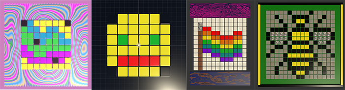

## Draw your pixel art

In this step you will draw your pixel art pattern in the Scene view.

Pixel art grew out of the limited resolution and colours available to developers of early video games and computer graphics. This style became popular in the 1980s and 1990s — the simple and distinctive designs still provoke a sense of nostalgia amongst gamers and artists alike. 

### Drag materials to pixels

--- task ---

Design your pixel art by dragging materials onto the cubes in your grid. 

**Tip:** If you drag a material onto the wrong cube, you can press <kbd>ctrl</kbd> / <kbd>cmd</kbd> and <kbd>z</kbd> to undo, or just drag a different material on.

--- /task ---

--- task ---

With **all** of the Floor cubes selected, add a script called `ChangeMaterial`:

--- code ---
---
language: cs 
filename: ChangeMaterial.cs 
line_numbers: true 
line_number_start: 1 
line_highlights: 
---

using System.Collections;
using System.Collections.Generic;
using UnityEngine;

public class ChangeMaterial : MonoBehaviour
{
  public Material start;
  public Material reveal;
  Renderer rend;

  // Start is called before the first frame update
  void Start()
  {
      rend = GetComponent<Renderer>();
      reveal = rend.sharedMaterial;
      rend.sharedMaterial = start;
  }

  void OnCollisionEnter(Collision collision)
  {
      if (collision.gameObject.tag == "Player"){
          rend.sharedMaterial = reveal;
      }
  }

}

--- /code ---

--- /task ---

--- task ---

Select **all** of the Floor cubes and add a Box Collider.

--- /task ---

--- task ---

**Choose** a start material for your Floor tiles. With **all** of the Floor cubes selected, drag the start material into the ChangeMaterial `Start` variable.

--- /task ---

--- task ---

**Test:** If you play your scene at this point, all the tiles should change to your start colour, but you don't have a way to reveal your pixel art yet. 

--- /task ----
