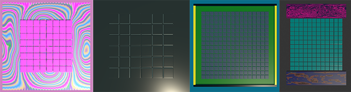

## Draw your pixel art

In this step you will draw your pixel art pattern in the Scene view.

{:width="350px"}

### Drag materials to pixels

--- task ---

Design your pixel art by dragging materials onto the cubes in your grid. 

**Tip:** If you drag a material onto the wrong cube you can press <kbd>ctrl</kbd> / <kbd>cmd</kbd> and <kbd>z</kbd> to undo or just drag a different material on.

--- /task ---

--- task ---

Add a new Tag for each of the colours in your design.  

--- /task ---

--- task ---

For each colour:

+ Select all of the pixels of that colour in the Scene view.
+ Add the corresponding tag in the Inspector. 

--- /task ---