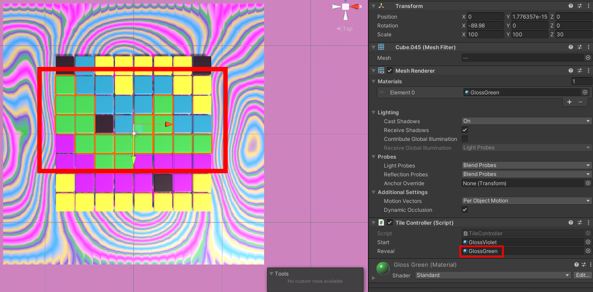

## Draw your pixel art

In this step you will draw your pixel art pattern in the Scene view.

### Drag materials to pixels

--- task ---

Design your pixel art by dragging materials onto the cubes in your grid. 

**Tip:** If you drag a material onto the wrong cube you can press <kbd>ctrl</kbd> / <kbd>cmd</kbd> and <kbd>z</kbd> to undo or just drag a different material on.

--- /task ---

--- task ---

With **all** of the Floor cubes selected, add a script called `TileController`:

--- code ---
---
language: cs 
filename: TileController.cs 
line_numbers: true 
line_number_start: 1 
line_highlights: 
---

using System.Collections;
using System.Collections.Generic;
using UnityEngine;

public class TileController : MonoBehaviour
{
  public Material start;
  public Material reveal;
  Renderer rend;

  // Start is called before the first frame update
  void Start()
  {
      rend = GetComponent<Renderer>();
      rend.sharedMaterial = start;
  }

  void OnCollisionEnter(Collision collision)
  {
      if (collision.gameObject.tag == "Player"){
          rend.sharedMaterial = reveal;
      }
  }

}

--- /code ---

--- /task ---

--- task ---

Select **all** of the Floor cubes and add a Box Collider.

--- /task ---

--- task ---

**Choose** a start material for your Floor tiles. With **all** of the Floor cubes selected, drag the start material into the TileController `Start` variable.

--- /task ---

--- task ---

For **each colour**:

+ Select all of the pixels of that colour in the Scene view.
+ Drag the corresponding material to the into the TileController `Reveal` variable.

--- /task ---

--- task ---

**Test:** If you play your scene at this point all the tiles should change to your start colour but you don't have a way to reveal your pixel art yet. 

--- /task ----
