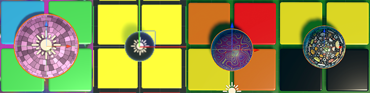
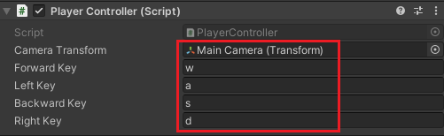
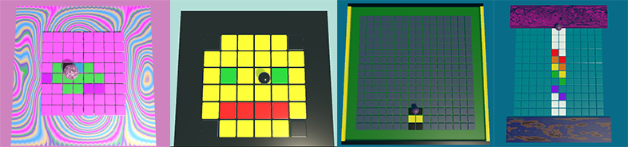
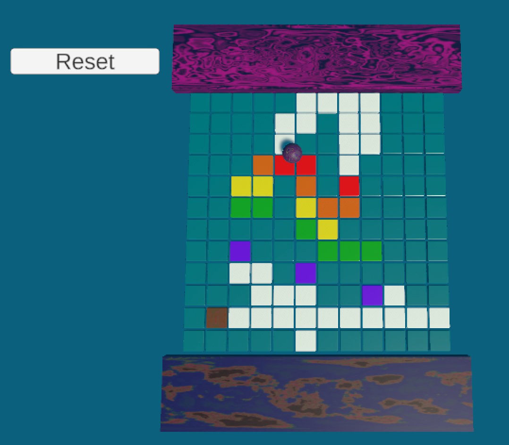

## Reveal the art

In this step you will add a ball that uncovers the pixel art as it rolls.

{:width="350px"}

### Add a ball

--- task ---

Create a sphere and name it 'Player1'.

**Reset** the 'Transform'.

--- /task ---

--- task ---

**Choose** a size for your ball by changing the 'Transform Scale' properties.

--- /task ---

--- task ---

Position the sphere where you want it to start. 

--- /task ---

--- task ---

Choose a material for the player and drag it on to the sphere in the Scene view.

--- /task ---

--- task ---

Tag the sphere 'Player'.

--- /task ---

--- task ---

Add a 'PlayerController' script to your sphere and set it up to use the keys of your choice. 

--- collapse ---
---
title: Roll a ball with keys
---

+ Add the RigidBody component to the 'Player1' GameObject.

+ Add a new script called 'PlayerController' to the 'Player1' GameObject:

--- code ---
---
language: cs 
filename: PlayerController.cs 
line_numbers: true 
line_number_start: 1 
line_highlights: 
---

using System.Collections; 
using System.Collections.Generic; 
using UnityEngine;

public class PlayerController : MonoBehaviour { 
    public Transform cameraTransform; 
    public string forwardKey; 
    public string leftKey; 
    public string backwardKey; 
    public string rightKey; 
    Rigidbody rb;

// Start is called before the first frame update
void Start()
{
    rb = this.GetComponent<Rigidbody>();
    rb.transform.forward = cameraTransform.forward;
}

// FixedUpdate is called once per fixed frame-rate frame
void FixedUpdate()
{
    // Calculates cameraTransform.forward without the y value so the ball doesn't move up and down on the Y axis
    Vector3 forward = new Vector3(cameraTransform.forward.x, 0, cameraTransform.forward.z).normalized;
    Vector3 right = Quaternion.AngleAxis(90, Vector3.up) * forward;
    Vector3 left = -right;
    Vector3 backward = -forward;

    if (Input.GetKey(forwardKey))
    {
        rb.AddForce(forward * 5f);
    }

    if (Input.GetKey(rightKey))
    {
        rb.AddForce(right * 5f);
    }

    if (Input.GetKey(backwardKey))
    {
        rb.AddForce(backward * 5f);
    }

    if (Input.GetKey(leftKey))
    {
        rb.AddForce(left * 5f);
    }
}
}

--- /code ---

+ Select the 'Player1' GameObject to view the 'Inspector' options.

+ Drag the 'Main Camera' game object to the 'Camera Transform' variable in the 'Inspector'. 

+ Set the 'Forward Key', 'Left Key', 'Backward Key', and 'Right Key' to the lowercase letters that you want to use to control Player1. We used 'w', 'a', 's' and 'd'.

**Tip:** The letters for the keys need to be in lower case. 

--- /collapse ---

--- /task ---

### Set up your camera view

--- task ---

Changed your camera rotation to X = `85` so that it looks down on the art but with depth. 

--- /task ---

--- task ---

**Test** your project by pressing play. You should be able to move your player using the chosen keys on your keyboard.

<video width="640" height="360" controls preload="none" poster="images/ball-move.png">
<source src="images/ball-move.mp4" type="video/mp4">
Your browser does not support WebM video, try FireFox or Chrome
</video>

--- /task ---

### Reset the art

--- task ---

Add a reset option to reload your scene. This will position the ball at the start position and cover up the pixel art.

**Choose:** You can add a reset button or reset the game when the player Y position is below the floor: 

[[[unity-text-meshpro]]]

[[[unity-add-position-text]]]

--- collapse ---
---
title: Add code to reset on button click
---

Create a new `Reset` script on the ball:

--- code ---
---
language: cs 
filename: Reset.cs 
line_numbers: true 
line_number_start: 1 
line_highlights: 
---

using System.Collections;
using System.Collections.Generic;
using UnityEngine;
using UnityEngine.SceneManagement;
public class Reset : MonoBehaviour
{

    // Start is called before the first frame update
    void Start()
    {

    }

    // Update is called once per frame
    void Update()
    {

    }

    public void resetAll()
    {
        SceneManager.LoadScene(SceneManager.GetActiveScene().name);
    }
}

--- /code ---

Go to the Hierarchy window and click on the ‘Button’ GameObject.

In the Inspector window, scroll down until you see the ‘On Click()’ component.

Click on the the + sign to create a new action.

Drag the ‘Ball’ GameObject from the Hierarchy window to the Object property of the action.

Click on the function property and select Reset > resetAll() to call the resetAll method from your Reset script.

--- /collapse ---

--- collapse ---
---
title: Add code to reset the ball and tiles if the ball is below the floor
---

Create a new `Reset` script on the ball:

--- code ---
---
language: cs 
filename: Reset.cs 
line_numbers: true 
line_number_start: 1 
line_highlights: 
---
using System.Collections;
using System.Collections.Generic;
using UnityEngine;
using UnityEngine.SceneManagement;
public class Reset : MonoBehaviour
{

    // Start is called before the first frame update
    void Start()
    {

    }

    // Update is called once per frame
    void Update()
    {
       if (this.transform.position.y < -10)
       {
           SceneManager.LoadScene(SceneManager.GetActiveScene().name);
       }
    }
}

--- /code ---

--- /collapse ---

--- collapse ---
---
title: Add code to reset the ball if the ball is below the floor
---

Create a new `Reset` script on the ball:

--- code ---
---
language: cs 
filename: Reset.cs 
line_numbers: true 
line_number_start: 1 
line_highlights: 
---
using System.Collections;
using System.Collections.Generic;
using UnityEngine;
public class Reset : MonoBehaviour
{
    Rigidbody rb;
    Vector3 spawnPoint;

    // Start is called before the first frame update
    void Start()
    {
        rb = this.GetComponent<Rigidbody>();
        spawnPoint = transform.position;
    }

    // Update is called once per frame
    void Update()
    {

        if (this.transform.position.y < -10)
       {
           rb.velocity = Vector3.zero;
           rb.angularVelocity = Vector3.zero;
           transform.position = spawnPoint;
       }
    }
}

--- /code ---

--- /collapse ---

--- /task ---

--- task ---

**Test:** Play your game. After you have revealed some of your artwork, click on your reset button or deliberately fall off your pixel art platform to check that the ball and tiles reset. 

<video width="640" height="360" controls preload="none" poster="images/reset-ball.png">
<source src="images/reset-ball.mp4" type="video/mp4">
Your browser does not support WebM video, try FireFox or Chrome
</video>

--- /task ---

