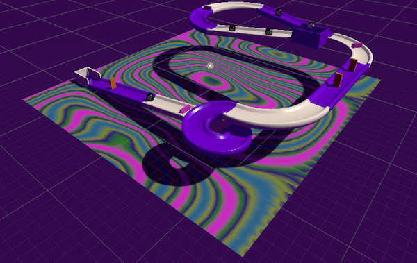

## What next?

If you are following the [More Unity](https://projects.raspberrypi.org/en/raspberrypi/more-unity) path, you can move on to the [Track designer](https://projects.raspberrypi.org/en/projects/track-designer) project. In this project, you will create a track and roll a marble down it by tilting the level!

--- no-print ---

Tilt the world using the <kbd>WASD</kbd> to roll the marble down the track.

<iframe allowtransparency="true" width="710" height="500" src="https://raspberrypilearning.github.io/unity-webgl/TrackDesigner/" frameborder="0" scrolling = "no"> </iframe>

--- /no-print ---

If you want to have more fun exploring Unity, then you could try out any of [these projects](https://projects.raspberrypi.org/en/projects?software%5B%5D=unity).

If you want to create your own material to add to your ball you could try out the [Blender: Add material effects to a marble](https://projects.raspberrypi.org/en/projects/blender-marble) project. 

If you want to create your own tiled floor you could try out the [Blender: Create a 3D tiled floor](https://projects.raspberrypi.org/en/projects/blender-tiled-floor) project. 
